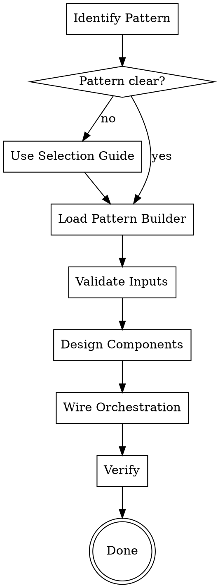

# Agentic AI Pattern Builder

Build agentic AI systems using proven design patterns. Guides you from pattern selection through component design to working implementation using Claude Code's Agent tool.

## When to Use

- Building a new multi-agent system and need the right pattern
- Implementing an agent orchestration workflow
- User says "build an agent that..." or "create a pipeline that..."
- Refactoring an ad-hoc agent system into a recognized pattern
- Comparing patterns for a specific use case

## When NOT to Use

- You already have a working agent and just need to tweak it
- Building a single non-agent skill (use `skill-creator:skill-creator`)
- Composing existing skills into an agent (use `agent-factory`)

## Pattern Catalog

```dot
digraph patterns {
    rankdir=TB;
    node [shape=box];

    subgraph cluster_single {
        label="Single Agent";
        "single-agent" [label="Single Agent\n─────────\nOne model + tools\nSimplest pattern"];
    }

    subgraph cluster_multi {
        label="Multi-Agent Patterns";
        style=dashed;

        subgraph cluster_flow {
            label="Flow Control";
            "sequential" [label="Sequential\n─────────\nLinear pipeline\nA → B → C"];
            "parallel" [label="Parallel\n─────────\nConcurrent fan-out\nA + B + C → merge"];
            "loop" [label="Loop\n─────────\nRepeat until\nexit condition"];
        }

        subgraph cluster_quality {
            label="Quality Patterns";
            "review-critique" [label="Review & Critique\n─────────\nGenerator → Critic\nApprove/reject cycle"];
            "iterative-refinement" [label="Iterative Refinement\n─────────\nProgressive improvement\nover multiple cycles"];
        }

        subgraph cluster_orchestration {
            label="Orchestration";
            "coordinator" [label="Coordinator\n─────────\nAI-driven routing\nto specialists"];
            "hierarchical" [label="Hierarchical\n─────────\nTask decomposition\nthrough layers"];
            "swarm" [label="Swarm\n─────────\nAll-to-all debate\nand convergence"];
        }
    }

    subgraph cluster_reasoning {
        label="Reasoning & Control";
        "react" [label="ReAct\n─────────\nThink → Act → Observe\nloop"];
        "human-in-the-loop" [label="Human-in-the-Loop\n─────────\nCheckpoint pauses\nfor approval"];
        "custom-logic" [label="Custom Logic\n─────────\nCode-driven branching\npattern mixing"];
    }
}
```

## Pattern Selection Guide

| Need | Pattern | Why |
|------|---------|-----|
| Simple tool-using agent | Single Agent | One model handles everything |
| Fixed-order pipeline | Sequential | Predictable, debuggable flow |
| Independent concurrent tasks | Parallel | Reduce latency via fan-out |
| Repeat until quality met | Loop | Iterative convergence |
| Output needs review gate | Review & Critique | Generator + critic separation |
| Progressive improvement | Iterative Refinement | Multiple drafts toward quality |
| Dynamic task routing | Coordinator | AI decides which specialist |
| Complex decomposition | Hierarchical | Multi-level delegation |
| Debate & convergence | Swarm | Cross-pollination of perspectives |
| Adaptive reasoning | ReAct | Think-act-observe flexibility |
| Critical decision points | Human-in-the-Loop | Human oversight at checkpoints |
| Complex branching logic | Custom Logic | Maximum orchestration flexibility |

## The Process

### Step 1: Identify the Pattern

If the user names a pattern, load its builder file directly. If not, use the Selection Guide table above to recommend one based on their requirements.

### Step 2: Load the Pattern Builder

Read the corresponding builder file from this skill's directory:

| Pattern | File |
|---------|------|
| Single Agent | `single-agent.md` |
| Sequential | `sequential.md` |
| Parallel | `parallel.md` |
| Loop | `loop.md` |
| Review & Critique | `review-critique.md` |
| Iterative Refinement | `iterative-refinement.md` |
| Coordinator | `coordinator.md` |
| Hierarchical | `hierarchical.md` |
| Swarm | `swarm.md` |
| ReAct | `react.md` |
| Human-in-the-Loop | `human-in-the-loop.md` |
| Custom Logic | `custom-logic.md` |

Read the file from the same directory as this SKILL.md, then follow its builder instructions.

### Step 3: Follow the Builder

Each builder file contains:
1. **Architecture diagram** — visual structure of the pattern
2. **Component table** — what to build and each component's role
3. **Builder template** — step-by-step construction guide
4. **Wiring instructions** — how to connect components using Claude Code's Agent tool
5. **Validation criteria** — how to verify the pattern is correctly implemented

### Step 4: Verify

Run the smoke test for the pattern to verify the implementation works:
- Invoke `smoke-agentic-patterns` with the pattern name as argument
- Or manually verify against the builder's validation criteria
