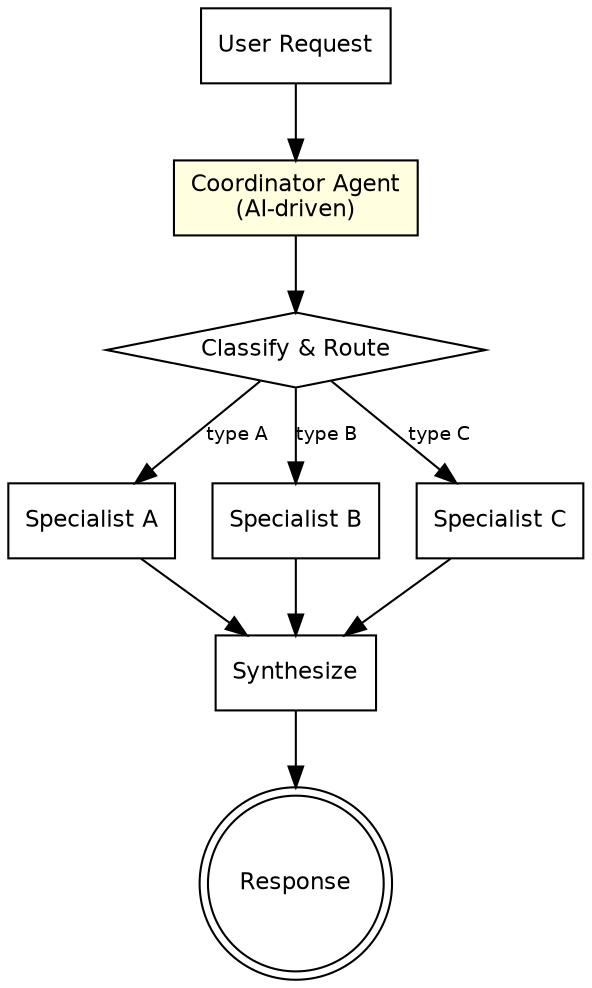

# Coordinator Pattern

A central coordinator agent uses an AI model to analyze requests, decompose them into sub-tasks, and dynamically route each to specialized agents. The key distinction from sequential or parallel patterns: the coordinator uses AI reasoning for routing decisions, not hardcoded logic. The coordinator classifies, dispatches, and synthesizes.

---

## Architecture



**Flow:** The user request enters the coordinator. The coordinator uses AI reasoning to classify the request and determine which specialist(s) to invoke. It dispatches to one or more specialists via Agent tool calls. Specialist results flow back to the coordinator, which synthesizes them into a unified response.

---

## When to Use

- Structured business processes requiring adaptive routing (support tickets, document processing)
- Customer service systems with multiple departments or skill areas
- Any system where the right specialist depends on request content analysis
- When routing logic is too nuanced for if/else rules and requires AI judgment
- Multi-domain systems where requests may span several specialist areas

**Do not use when:** Routing is simple and deterministic (use a router/switch instead). All requests go to the same agent. The overhead of classification is not justified.

**Key distinction from sequential/parallel:** In sequential and parallel patterns, the flow is predetermined. In the coordinator pattern, the AI decides at runtime which agents to invoke and in what combination.

---

## Component Table

| # | Component | Role | Implementation |
|---|-----------|------|----------------|
| 1 | Coordinator Agent | AI-driven classifier and router -- analyzes requests, dispatches to specialists, synthesizes results | Main Agent with classification + routing prompt |
| 2 | Classification Table | Maps signals and keywords to specialist agents | Embedded in coordinator prompt as a routing guide |
| 3 | Specialist Agents | Domain experts that handle specific request types | Individual Agent tool calls with domain-specific prompts |
| 4 | Synthesis Logic | Combines specialist outputs into a coherent response | Instructions in coordinator prompt for merging results |
| 5 | Fallback Routing | Handles requests that do not match any specialist | Default specialist or coordinator handles directly |

---

## Builder Template

Follow these steps to construct a coordinator system:

### Step 1: Define the specialist roster

List every specialist agent, its domain, and the signals that indicate a request belongs to it.

```
Specialist Roster:
| Specialist | Domain | Trigger Signals |
|------------|--------|-----------------|
| billing-agent | Billing & payments | "invoice", "charge", "refund", "payment", pricing questions |
| technical-agent | Technical support | error messages, stack traces, "not working", "how to configure" |
| account-agent | Account management | "password", "login", "permissions", "access", profile changes |
| onboarding-agent | New user setup | "getting started", "first time", "setup", "trial" |
```

### Step 2: Build the classification table

Define how the coordinator maps request characteristics to specialists. Include multi-specialist routing rules.

```
Classification Rules:
- Single specialist: Route to the specialist with strongest signal match
- Multiple specialists: If request spans domains, route to all relevant specialists
- Ambiguous: If no clear match, ask a clarifying question OR route to a default generalist
- Priority: If signals match multiple specialists equally, prefer [priority order]
```

### Step 3: Build the coordinator prompt

The coordinator must classify, route, and synthesize.

```
You are a coordinator agent. Your job is to analyze incoming requests, determine which
specialist(s) should handle them, and synthesize the results.

SPECIALIST ROSTER:
{specialist_roster_table}

CLASSIFICATION RULES:
{classification_rules}

For the following request, determine:
1. Which specialist(s) to route to (list their names)
2. What specific sub-task each specialist should handle
3. Any context the specialist needs from the original request

REQUEST:
{user_request}

After receiving specialist responses, synthesize them into a single coherent response
for the user. Do not expose the internal routing to the user.
```

### Step 4: Build each specialist's prompt template

Each specialist has a focused prompt for its domain.

```
You are a {domain} specialist. Handle the following request within your area of expertise.

CONTEXT FROM COORDINATOR:
{coordinator_context}

USER REQUEST (relevant portion):
{sub_task}

Provide a complete response within your domain. If the request touches areas outside
your expertise, note what you cannot address and the coordinator will route those
portions elsewhere.
```

### Step 5: Wire the coordinator flow

```
user_request = get_request()

# Step 1: Coordinator classifies and plans routing
routing_plan = Agent(coordinator_classification_prompt(user_request))
# Returns: list of (specialist_name, sub_task, context) tuples

# Step 2: Dispatch to specialists
specialist_results = {}
for specialist, sub_task, context in routing_plan:
    result = Agent(specialist_prompt(specialist, sub_task, context))
    specialist_results[specialist] = result

# Step 3: Coordinator synthesizes
final_response = Agent(coordinator_synthesis_prompt(user_request, specialist_results))
return final_response
```

### Step 6: Define fallback behavior

```
Fallback handling:
- No specialist match: Coordinator handles the request directly as a generalist
- Specialist fails: Coordinator notes the gap and provides partial response
- Ambiguous routing: Coordinator asks the user a clarifying question
- Multi-specialist conflict: Coordinator resolves contradictions, preferring [priority]
```

---

## Wiring Instructions (Claude Code Agent Tool)

In Claude Code, wire this pattern using the Agent tool for both classification and specialist dispatch:

1. **Coordinator as orchestrator:** The main prompt acts as the coordinator. It analyzes the request and decides which Agent calls to make.

2. **Classification phase:** The coordinator can either:
   - Classify in the main prompt (no separate Agent call needed if the coordinator is the top-level prompt)
   - Use a dedicated Agent call for classification if the logic is complex

3. **Specialist dispatch:** Each specialist is an Agent tool call with a domain-specific prompt. If multiple specialists are needed and their tasks are independent, dispatch them in parallel using multiple Agent calls in the same turn.

4. **Context passing:** When dispatching to specialists, include:
   - The relevant portion of the user request
   - Any coordinator-determined context
   - Constraints on scope (what the specialist should and should not address)

5. **Synthesis:** After all specialist Agent calls return, the coordinator synthesizes results. This can happen in the main prompt without a separate Agent call, or via a dedicated synthesis Agent call if the merging logic is complex.

6. **Routing transparency:** The final response should not expose internal routing decisions to the user. Present a unified response as if a single agent handled everything.

---

## Validation Criteria

A correctly wired coordinator pattern demonstrates:

| Check | Expected Behavior |
|-------|-------------------|
| Correct classification | Coordinator identifies the right specialist(s) for a given request type |
| Appropriate routing | Requests reach the specialist with relevant domain expertise |
| Multi-specialist routing | Requests spanning domains are routed to all relevant specialists |
| Ambiguous request handling | Unclear requests trigger clarification or fallback, not random routing |
| Specialist focus | Each specialist handles only its domain portion, not the entire request |
| Coherent synthesis | Multi-specialist results are merged into a unified, non-contradictory response |
| Fallback works | Requests matching no specialist are handled gracefully |
| No routing leak | The user sees a unified response, not internal routing details |
| Context preserved | Specialists receive sufficient context from the coordinator to respond effectively |
