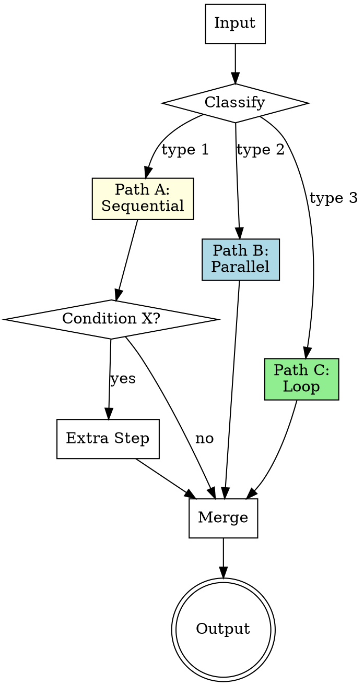

# Custom Logic Pattern

Maximum flexibility through code-based orchestration. Developers implement specific orchestration logic mixing conditional statements, loops, and multiple patterns. Enables combining sequential, parallel, coordinator, and other patterns within a single workflow. The "escape hatch" for workflows that do not fit neatly into any single pattern.

---

## Architecture



**Flow:** Input is classified to determine which execution path to follow. Each path may use a different pattern (sequential, parallel, loop, or nested combinations). Conditional logic within paths adds further branching. All paths converge at a merge point that produces the final output.

---

## When to Use

- Complex branching logic that goes beyond linear sequences
- Workflows that mix multiple agentic patterns within a single process
- Process-specific orchestration with domain rules
- When no single pattern fits the requirement
- Workflows with dynamic routing based on intermediate results
- Enterprise processes with established decision trees
- Prototyping novel agent architectures

---

## Component Table

| # | Component          | Role                                                        | Implementation Notes                                |
|---|-------------------|-------------------------------------------------------------|-----------------------------------------------------|
| 1 | Input Classifier   | Determines which branch/path to take                        | Can be rule-based, AI-classified, or data-driven    |
| 2 | Branch Definitions | Different execution paths, each potentially a different pattern | Each branch is self-contained with clear I/O        |
| 3 | Conditional Logic  | If/else/switch routing within and between branches          | Based on intermediate results, metadata, or rules   |
| 4 | Pattern Instances  | Embedded sequential, parallel, loop, or other patterns      | Each sub-pattern follows its own builder template    |
| 5 | Merge Logic        | How branches converge into a single output                  | Concatenation, synthesis, selection, or aggregation  |
| 6 | Error Handling     | Per-branch failure strategies                               | Fallback branches, retry logic, graceful degradation |

---

## Builder Template

Follow these steps to construct a custom logic workflow:

### Step 1: Map the Decision Tree

Before writing any prompts, diagram the complete workflow:

```
Input
  |
  +--> [Classify]
  |       |
  |       +--> [Type A] --> Step A1 --> Step A2 --> [Condition?]
  |       |                                           |
  |       |                                    yes ---+--> Step A3
  |       |                                    no  ---+--> skip
  |       |
  |       +--> [Type B] --> [Parallel: B1, B2, B3] --> Merge B
  |       |
  |       +--> [Type C] --> [Loop: until done] --> Exit
  |
  +--> [Merge all paths] --> Output
```

Document every branch, condition, and merge point. Identify:
- All possible paths through the workflow
- What determines which path is taken
- Where paths can merge or cross
- What happens when a path fails

### Step 2: Identify Embedded Patterns

For each branch, determine which agentic pattern it uses:

| Branch | Pattern     | Justification                              |
|--------|-------------|--------------------------------------------|
| Path A | Sequential  | Steps must execute in order, each depends on previous |
| Path B | Parallel    | Sub-tasks are independent, can run simultaneously |
| Path C | Loop/ReAct  | Iterative refinement until quality threshold met |

Refer to each pattern's dedicated builder file for detailed construction.

### Step 3: Define Classification Logic

The classifier determines which branch to execute. Options:

**Rule-based classification:**
```
if input.type == "bug_report":
    execute Path A (investigation workflow)
elif input.type == "feature_request":
    execute Path B (design workflow)
elif input.type == "refactor":
    execute Path C (analysis workflow)
```

**AI-based classification:**
```
Prompt: "Classify the following request into one of these categories:
- Type 1: [description, examples]
- Type 2: [description, examples]
- Type 3: [description, examples]
Respond with only the type number and a one-sentence justification."
```

**Data-driven classification:**
Based on metadata, file types, project configuration, or external signals.

### Step 4: Build Branch-Specific Prompts

Each branch gets its own prompt following the relevant pattern's template:
- Sequential branches: ordered step prompts with handoff
- Parallel branches: independent task prompts with merge instructions
- Loop branches: iteration prompts with exit conditions
- Nested combinations: compose from inner pattern outward

### Step 5: Wire the Orchestration

```
# Step 1: Classify
classification = Agent("Classify this input: {input}")

# Step 2: Route to branch
if classification == "type_1":
    # Sequential branch
    step1_result = Agent("Phase 1 prompt: {input}")
    step2_result = Agent("Phase 2 prompt: {step1_result}")

    # Conditional within branch
    if step2_result.needs_extra:
        step3_result = Agent("Extra step prompt: {step2_result}")
    else:
        step3_result = step2_result

elif classification == "type_2":
    # Parallel branch
    results = parallel(
        Agent("Sub-task B1: {input}"),
        Agent("Sub-task B2: {input}"),
        Agent("Sub-task B3: {input}")
    )
    step3_result = Agent("Merge prompt: {results}")

elif classification == "type_3":
    # Loop branch
    step3_result = Agent("Iterative task with exit conditions: {input}")

# Step 3: Merge
final_output = Agent("Synthesize final output: {step3_result}")
```

### Step 6: Define Error Handling Per Branch

For each branch, specify:

| Failure Scenario              | Response                                    |
|-------------------------------|---------------------------------------------|
| Classification ambiguous      | Default to most common branch, or ask user  |
| Branch step fails             | Retry once, then fall back to simpler path  |
| Branch produces low quality   | Route to quality-check loop before merging  |
| Merge receives incompatible inputs | Flag conflict, present options to user  |
| Timeout                       | Return partial results with status report   |

### Step 7: Test Each Branch Independently

Before testing the full workflow:
1. Test the classifier with diverse inputs
2. Test each branch in isolation with representative inputs
3. Test conditional logic within branches with edge cases
4. Test merge logic with outputs from different branches
5. Test error handling for each failure scenario
6. Then test the full end-to-end workflow

---

## Wiring Instructions (Claude Code Agent Tool)

**Classification step:**
First Agent tool call classifies the input. Parse the classification from the output to determine which branch to execute.

**Branch execution:**
Use Agent tool calls according to the branch's pattern:
- Sequential: chained Agent calls, each receiving the previous output
- Parallel: simultaneous Agent calls, results gathered
- Loop: repeated Agent calls with accumulated context until exit condition

**Conditional logic:**
The orchestrating prompt (or the calling code) inspects intermediate results to decide:
- Whether to execute optional steps
- Which sub-branch within a branch to take
- Whether to short-circuit and skip remaining steps

**Merge step:**
Final Agent call receives outputs from whichever branch executed. The merge prompt should handle any branch's output format.

**Key wiring considerations:**
- Keep the orchestration logic as simple as possible -- complexity should live in the branch prompts, not the routing
- Use structured output (JSON, labeled sections) from the classifier to make routing reliable
- Document the decision tree so the workflow is maintainable
- Consider adding a "fallback" branch for unclassifiable inputs
- For deeply nested logic, decompose into sub-workflows that are each testable independently
- Log which branch was taken for debugging and optimization

---

## Validation Criteria

| Check                          | What to Verify                                                        |
|--------------------------------|-----------------------------------------------------------------------|
| Classifier accuracy            | Inputs are correctly routed to the appropriate branch                 |
| Branch isolation               | Each branch executes its embedded pattern correctly in isolation      |
| Conditional logic correctness  | Edge cases in if/else/switch routing are handled                      |
| Merge coherence                | Final output is coherent regardless of which branch executed          |
| Cross-branch consistency       | Output format and quality are consistent across all paths             |
| Error handling per branch      | Failures in one branch trigger the correct fallback, not a crash      |
| Unknown input handling         | Inputs that do not match any branch are handled gracefully            |
| End-to-end flow                | Full workflow produces correct results for representative inputs from each branch |
| Composability                  | Embedded patterns (sequential, parallel, loop) work correctly when nested |
| Maintainability                | Decision tree is documented and new branches can be added without breaking existing ones |
