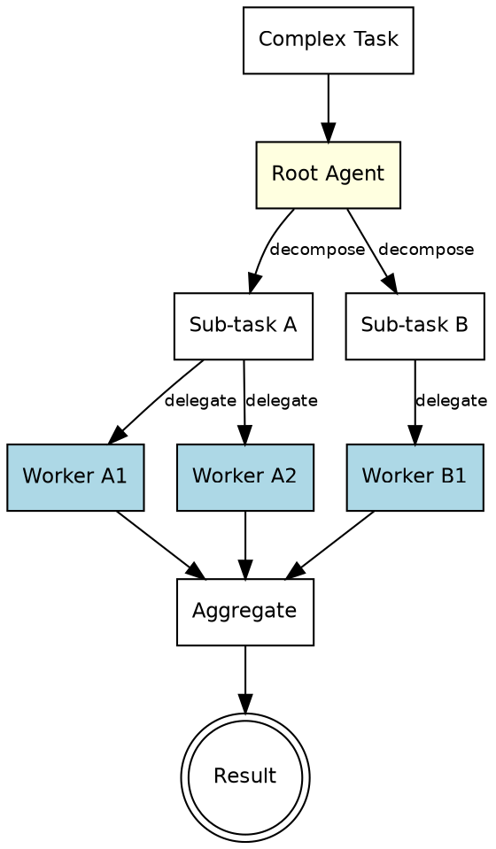

# Hierarchical Task Decomposition Pattern

A root agent decomposes complex tasks into sub-tasks, delegating to agents at lower hierarchy levels. This process repeats through multiple layers -- agents decompose further until tasks are simple enough for worker agents to execute directly. This is a recursive coordinator pattern where decomposition depth is determined at runtime.

---

## Architecture



**Flow:** A complex task enters the root agent. The root decomposes it into sub-tasks and delegates each to an intermediate agent (yellow nodes). Intermediate agents may decompose further or delegate directly to worker agents (blue nodes). Workers execute leaf-level tasks and return results. Results flow upward through the hierarchy, aggregated at each level, until the root produces the final output.

---

## When to Use

- Ambiguous, open-ended problems requiring extensive planning before execution
- Complex research tasks spanning multiple domains or sources
- Large codebases where changes span many files and modules
- Any task too large for a single agent to hold in context
- When the decomposition strategy itself requires AI reasoning

**Do not use when:** The task decomposition is known in advance (use sequential or parallel). The task is small enough for a single agent. The overhead of multi-level delegation is not justified.

**Key distinction from coordinator:** The coordinator routes to known specialists based on request type. The hierarchical pattern recursively decomposes unknown tasks into progressively smaller pieces until they are worker-executable.

---

## Component Table

| # | Component | Role | Implementation |
|---|-----------|------|----------------|
| 1 | Root Agent | Top-level decomposer -- analyzes the full task and breaks it into major sub-tasks | Agent with decomposition + aggregation prompt |
| 2 | Intermediate Agents | Further decompose sub-tasks or delegate to workers if simple enough | Agent tool calls that can themselves spawn Agent calls |
| 3 | Worker Agents | Execute leaf-level tasks and return concrete results | Agent tool calls with focused execution prompts |
| 4 | Aggregation Logic | Combines worker results upward through the hierarchy | Instructions at each level for merging child results |
| 5 | Depth Limit | Prevents infinite decomposition -- caps the recursion depth | Counter passed down and checked at each level |

---

## Builder Template

Follow these steps to construct a hierarchical task decomposition system:

### Step 1: Define the task domain and complexity indicators

Identify what makes a task "complex" (needs decomposition) versus "simple" (can be executed directly).

```
Task domain: [e.g., "Codebase refactoring", "Research report", "System migration"]

Complexity indicators (decompose if present):
- Task spans multiple modules, files, or domains
- Task requires more than ~500 lines of output
- Task has dependencies between sub-components
- Task requires different expertise areas

Simplicity indicators (execute directly):
- Task affects a single file or function
- Task has a clear, bounded scope
- Task can be completed in a single Agent call
- Expected output is under ~200 lines
```

### Step 2: Define the decomposition strategy

How should agents split tasks? Define the decomposition heuristics.

```
Decomposition strategies:
- By domain: Split by subject area (frontend/backend/database)
- By file: Split by file or module boundary
- By concern: Split by functional concern (logic, UI, testing, docs)
- By phase: Split by sequential phases (analyze, implement, verify)
- Hybrid: Combine strategies based on task characteristics
```

### Step 3: Define worker capabilities

What can leaf-level workers do? Define their scope and limitations.

```
Worker capabilities:
- Read and analyze a single file or small set of related files
- Write or modify code in a bounded scope
- Research a specific, well-defined question
- Generate a single section of a document
- Run and interpret a specific test or command

Worker limitations:
- Cannot hold more than ~one file of context effectively
- Cannot make cross-cutting decisions affecting other workers
- Must return complete results (not partial or "continued in next call")
```

### Step 4: Build the root agent prompt

The root agent decomposes, delegates, and aggregates.

```
You are a root decomposition agent. Your job is to break down complex tasks into
manageable sub-tasks, delegate them, and aggregate the results.

TASK:
{complex_task}

DECOMPOSITION RULES:
- Break the task into 2-5 major sub-tasks
- Each sub-task should be independently executable
- Identify dependencies between sub-tasks (which must complete before others start)
- For each sub-task, determine if it needs further decomposition or is worker-ready

DEPTH: You are at level 0 of {max_depth}. You may decompose up to {max_depth} levels deep.

For each sub-task:
1. Define the sub-task clearly with scope boundaries
2. Specify the expected output format
3. Note any dependencies on other sub-tasks
4. Delegate via Agent tool call

After all sub-tasks complete, aggregate their results into a coherent final output.
```

### Step 5: Build worker agent prompts

Workers receive focused, bounded tasks.

```
You are a worker agent executing a specific task. Complete ONLY the task described below.
Do not attempt to solve the broader problem.

TASK:
{leaf_task}

SCOPE:
{scope_boundaries}

EXPECTED OUTPUT FORMAT:
{output_format}

CONTEXT FROM PARENT:
{parent_context}

Return your complete result. If you cannot complete the task, explain what is blocking you.
```

### Step 6: Wire the recursive delegation

```
function decompose_and_execute(task, depth, max_depth):
    if depth >= max_depth or is_simple(task):
        # Leaf level: execute directly
        return Agent(worker_prompt(task))

    # Decompose
    sub_tasks = Agent(decomposition_prompt(task, depth, max_depth))

    # Delegate (parallel where no dependencies, sequential where dependencies exist)
    results = {}
    for group in dependency_order(sub_tasks):
        # Independent tasks in this group run in parallel
        for sub_task in group:
            results[sub_task] = decompose_and_execute(sub_task, depth + 1, max_depth)

    # Aggregate
    return Agent(aggregation_prompt(task, results))

final_result = decompose_and_execute(complex_task, depth=0, max_depth=3)
```

### Step 7: Set depth and breadth limits

```
Limits:
- Max depth: 2-3 levels (root -> intermediate -> worker)
- Max breadth: 2-5 sub-tasks per decomposition
- Max total agents: depth * breadth (e.g., 3 levels * 5 breadth = ~15 max agent calls)
- Timeout: Set a wall-clock limit for the entire hierarchy
```

---

## Wiring Instructions (Claude Code Agent Tool)

In Claude Code, wire this pattern using nested Agent tool calls:

1. **Root agent as orchestrator:** The main prompt acts as the root agent. It analyzes the complex task and determines the first level of decomposition.

2. **Sub-task delegation:** Each sub-task is dispatched via an Agent tool call. The sub-task agent's prompt includes:
   - The specific sub-task description
   - The current depth level
   - Permission to further decompose (if depth < max_depth)
   - The expected output format

3. **Recursive decomposition:** Intermediate agents (spawned by the root) can themselves use the Agent tool to spawn further agents. Each level passes `depth + 1` to its children. When `depth >= max_depth`, the agent executes directly instead of decomposing further.

4. **Dependency management:** If sub-tasks have dependencies:
   - Independent sub-tasks: dispatch via parallel Agent calls in the same turn
   - Dependent sub-tasks: dispatch sequentially, passing prior results as context

5. **Result aggregation:** As Agent calls return results, each parent level aggregates its children's results. The root agent performs the final aggregation into the complete output.

6. **Depth enforcement:** Every agent prompt includes the current depth and max depth. Agents at max depth must execute directly and must not attempt further decomposition.

---

## Validation Criteria

A correctly wired hierarchical task decomposition pattern demonstrates:

| Check | Expected Behavior |
|-------|-------------------|
| Root decomposes correctly | Complex task is split into 2-5 coherent, non-overlapping sub-tasks |
| Sub-tasks are well-scoped | Each sub-task has clear boundaries and expected output format |
| Workers can execute | Leaf-level tasks are small enough for a single agent to complete |
| Dependencies respected | Dependent sub-tasks execute after their prerequisites complete |
| Independent tasks parallelize | Sub-tasks without dependencies are dispatched in parallel |
| Results aggregate coherently | Worker results combine into a unified final output without gaps or contradictions |
| Depth limit respected | Recursion stops at max_depth -- no infinite decomposition |
| Breadth is reasonable | No decomposition level produces more than 5 sub-tasks |
| Context flows downward | Workers receive sufficient context from their parent to execute effectively |
| Results flow upward | Each level aggregates child results before returning to its parent |
| Fallback on failure | If a worker cannot complete its task, the parent handles the gap gracefully |
