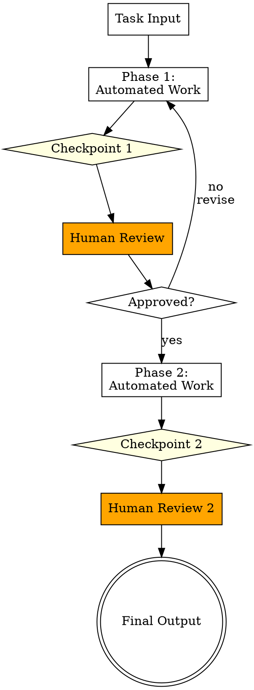

# Human-in-the-Loop Pattern

Agent workflow pauses at predefined checkpoints awaiting human review. A person approves decisions, corrects errors, or provides input the agent cannot determine on its own. Agent resumes after human intervention. Integrates human oversight into critical junctures of automated workflows.

---

## Architecture



**Flow:** Automated work proceeds in phases. At each checkpoint, the workflow pauses and presents a summary to the human reviewer. The human approves (continue to next phase), rejects (revise and retry the current phase), or provides corrective input. After the final checkpoint, the workflow produces its output.

---

## When to Use

- Tasks requiring human oversight for critical decisions
- Compliance and regulatory validation steps
- Actions with irreversible consequences (deployments, deletions, financial transactions)
- Subjective judgment calls (design quality, tone, prioritization)
- Safety-critical operations
- Workflows where trust needs to be built incrementally
- Any process with legal or ethical review requirements

---

## Component Table

| # | Component                | Role                                                      | Implementation Notes                             |
|---|-------------------------|-----------------------------------------------------------|--------------------------------------------------|
| 1 | Automated Workflow Phases | Segments of work the agent performs independently          | Each phase is self-contained and produces reviewable output |
| 2 | Checkpoint Definitions   | Where the workflow pauses for human input                  | Defined by risk level, decision importance, or policy |
| 3 | Review Presentation      | What to show the human at each checkpoint                  | Summary, diff, options, confidence level, risks  |
| 4 | Approval/Rejection Mechanism | How the human signals their decision                  | Yes/no, choice from options, free-text feedback  |
| 5 | Feedback Incorporation   | How human input modifies the workflow                      | Revise current phase, adjust parameters, override |
| 6 | Resume Logic             | How the workflow continues after human input               | Re-execute phase with corrections, proceed to next phase |

---

## Builder Template

Follow these steps to construct a human-in-the-loop workflow:

### Step 1: Define the Workflow Phases

Break the overall task into discrete phases of automated work. Each phase should:
- Have a clear input and output
- Produce work that can be meaningfully reviewed
- Be re-executable if the human rejects and requests revision

Example phases for a code migration task:
```
Phase 1: Analyze current codebase and produce migration plan
  -> Checkpoint: Human reviews and approves the plan
Phase 2: Execute migration according to approved plan
  -> Checkpoint: Human reviews changed files
Phase 3: Run tests and produce validation report
  -> Checkpoint: Human reviews test results and signs off
```

### Step 2: Define Checkpoints

For each checkpoint, specify:
- **Trigger condition** -- what completes the preceding phase
- **Risk level** -- why human review is needed here
- **Blocking vs. advisory** -- must the human approve, or is this informational?

Checkpoint placement heuristics:
- Before any irreversible action (deploy, delete, publish)
- After analysis but before execution
- When confidence is below threshold
- At domain boundaries (technical to business decisions)
- Where regulatory or compliance review is required

### Step 3: Design Review Presentations

For each checkpoint, define what the human sees:

```
## Checkpoint: [Name]

### Summary
[1-3 sentence summary of what was done and what is proposed]

### Details
[Relevant details: diff, analysis, options considered]

### Recommendation
[Agent's recommendation with confidence level]

### Decision Needed
[Specific question for the human]
- Option A: [description]
- Option B: [description]
- Option C: Provide custom direction

### Risks
[What could go wrong if this proceeds as-is]
```

### Step 4: Define Approval and Rejection Flows

**On approval:**
- Log the approval with timestamp
- Proceed to the next phase with any additional human input incorporated
- Pass the approval context to the next phase if relevant

**On rejection:**
- Capture the reason and specific feedback
- Re-execute the current phase with the feedback as additional constraints
- Present revised work at the same checkpoint
- Track revision count (set max revisions to prevent infinite loops)

**On abort:**
- Clean up any partial work
- Produce a summary of what was completed
- Save state for potential resumption

### Step 5: Wire the Workflow

```
Phase 1: Agent tool call (automated work)
    |
    v
Checkpoint 1: AskUserQuestion (present summary, request approval)
    |
    +--[approved]--> Phase 2: Agent tool call
    |
    +--[rejected]--> Incorporate feedback, re-run Phase 1
    |
    +--[abort]----> Clean up, produce partial summary
    |
    v
Phase 2: Agent tool call (automated work)
    |
    v
Checkpoint 2: AskUserQuestion (present results, request sign-off)
    |
    v
Final Output
```

### Step 6: Define Abort Conditions

- Max revision attempts per checkpoint (typically 2-3)
- Human explicitly requests abort
- Phase produces error that cannot be auto-recovered
- Timeout (if applicable)

---

## Wiring Instructions (Claude Code Agent Tool)

**Primary mechanism: AskUserQuestion tool**
At each checkpoint, use AskUserQuestion (or direct terminal output with user prompt) to pause the workflow and present the review summary. The user's response drives the next phase.

**Phase execution:**
Each automated phase is an Agent tool call with a well-defined prompt. The prompt should:
1. Describe the phase's objective
2. Include any human feedback from previous checkpoints
3. Specify the output format for the review presentation
4. Include constraints from earlier approvals

**Checkpoint implementation:**
```
# After Phase 1 Agent call completes:
AskUserQuestion:
  "Phase 1 complete. Here is the migration plan:
   [summary from Phase 1 output]

   Do you approve this plan?
   - 'yes' to proceed to execution
   - 'no' with feedback to revise the plan
   - 'abort' to stop"
```

**Handling rejection:**
When the human rejects, the next Agent call receives:
1. The original task
2. The rejected output
3. The human's specific feedback
4. Instruction to revise addressing the feedback

**Key wiring considerations:**
- Keep review presentations concise -- humans will skip walls of text
- Provide clear, actionable options at each checkpoint
- Always include an abort/escape option
- Log all human decisions for audit trail
- If a phase is re-executed after rejection, clearly indicate what changed
- For long workflows, provide progress indicators ("Checkpoint 2 of 4")

---

## Validation Criteria

| Check                          | What to Verify                                                        |
|--------------------------------|-----------------------------------------------------------------------|
| Checkpoint completeness        | Agent pauses at every defined checkpoint, never skips one             |
| Presentation clarity           | Review summaries are concise, actionable, and contain the right level of detail |
| Approval flow                  | Approved checkpoints correctly advance to the next phase              |
| Rejection flow                 | Rejected checkpoints trigger revision with human feedback incorporated |
| Feedback incorporation         | Revised output demonstrably addresses the human's specific feedback   |
| Abort handling                 | Abort cleanly stops the workflow and produces a partial summary       |
| Max revision enforcement       | Repeated rejections hit a limit rather than looping forever           |
| State preservation             | Each phase receives context from previous approvals correctly         |
| No unauthorized actions        | Agent does not perform irreversible actions before checkpoint approval |
| Audit trail                    | All human decisions are logged with what was presented and what was decided |
