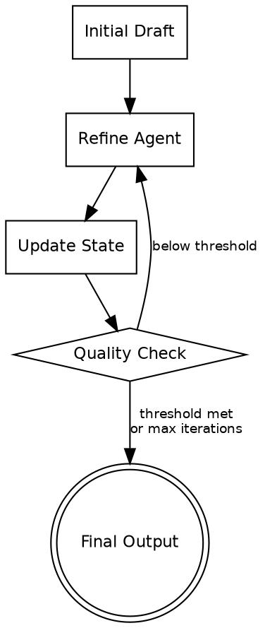

# Iterative Refinement Pattern

Agents work within a loop to progressively improve stored output over multiple cycles. Unlike review-critique, refinement agents may be the same agent improving its own work, and the evaluation can be automated rather than agent-based. The focus is on measurable, incremental improvement toward a quality threshold.

---

## Architecture



**Flow:** An initial draft is generated. The refinement agent receives the current state plus improvement instructions. After each refinement pass, the state is updated and a quality check determines whether to continue or exit. The loop exits when the quality threshold is met or maximum iterations are reached.

---

## When to Use

- Complex generation that is difficult to achieve in a single step
- Document writing requiring multiple drafts (clarity, structure, completeness)
- Progressive enhancement of code, prose, designs, or data transformations
- When improvement can be measured objectively (test pass rate, readability score, coverage)
- When the same agent can improve its own work with targeted instructions

**Do not use when:** A single generation pass is sufficient. When a separate critic perspective is needed (use review-critique instead). When the task is not amenable to incremental improvement.

**Key distinction from review-critique:** In iterative refinement, the evaluation may be automated (run tests, count errors, measure a metric). There is no separate "critic agent" making a judgment call -- the quality check can be a function, a test suite, or a simple heuristic.

---

## Component Table

| # | Component | Role | Implementation |
|---|-----------|------|----------------|
| 1 | Initial Draft Generator | Produces the first version of the output | Agent tool call or direct generation |
| 2 | Refinement Agent | Receives current state + improvement focus, returns improved version | Agent tool call (may be same agent, different prompt) |
| 3 | State Storage | Holds the accumulated output between iterations | Variable or file that persists across loop iterations |
| 4 | Quality Evaluator | Measures improvement -- automated metric or agent-based | Function (test runner, linter, scorer) or Agent tool call |
| 5 | Iteration Tracker | Counts iterations, enforces exit conditions | Counter + threshold comparison |

---

## Builder Template

Follow these steps to construct an iterative refinement system:

### Step 1: Define the initial generation task

Specify what the first draft should contain. It does not need to be perfect -- it needs to be a starting point that can be improved.

```
Initial generation task: [e.g., "Write a first draft of the API documentation covering all endpoints"]
Output format: [e.g., "Markdown document with endpoint sections"]
```

### Step 2: Define refinement criteria

What should improve with each pass? Be specific about the dimensions of improvement.

```
Refinement dimensions:
- Pass 1 focus: Structure and completeness (are all sections present?)
- Pass 2 focus: Accuracy and detail (are examples correct? are edge cases documented?)
- Pass 3 focus: Clarity and polish (is the language clear? are there redundancies?)
```

Alternatively, use a single refinement instruction applied repeatedly:
```
Each pass: Review the current output and improve [specific quality dimension].
```

### Step 3: Define the quality metric

How do you measure whether the output is good enough to stop?

```
Quality metric options:
- Automated: Run test suite, count passing tests (exit when all pass)
- Automated: Linter error count (exit when zero errors)
- Automated: Word count or coverage checklist (exit when all items covered)
- Agent-based: Ask an evaluator agent to score 1-10 (exit when score >= 8)
- Heuristic: Fixed number of iterations (always run exactly N passes)
```

### Step 4: Build the refinement prompt

The refinement prompt receives the current state and returns an improved version.

```
You are improving the following [output type]. This is refinement pass {iteration} of {max_iterations}.

CURRENT STATE:
{current_output}

IMPROVEMENT FOCUS FOR THIS PASS:
{refinement_focus}

QUALITY FEEDBACK FROM PREVIOUS CHECK:
{quality_feedback}

Return the complete improved version. Do not summarize changes -- return the full updated output.
```

### Step 5: Wire the refinement loop

```
current_state = Agent(initial_generation_prompt)
iteration = 0
max_iterations = 5

while iteration < max_iterations:
    quality_score = evaluate(current_state)

    if quality_score >= threshold:
        return current_state

    refinement_focus = get_focus_for_iteration(iteration)
    quality_feedback = get_feedback(quality_score)

    improved = Agent(refinement_prompt(current_state, refinement_focus, quality_feedback))
    current_state = improved
    iteration += 1

return current_state  # Best effort after max iterations
```

### Step 6: Define exit conditions

```
Exit conditions (any triggers exit):
- Quality threshold met (e.g., score >= 8, all tests pass, zero linter errors)
- Max iterations reached (typically 3-5)
- No improvement detected (current score <= previous score)
- Diminishing returns (improvement < minimum delta)
```

---

## Wiring Instructions (Claude Code Agent Tool)

In Claude Code, wire this pattern using Agent tool calls in a loop with state accumulation:

1. **Initial generation:** First Agent call produces the initial draft. Store the full output as current state.

2. **Quality evaluation:** After each iteration, evaluate the current state. This can be:
   - A Bash tool call (run tests, run linter, count errors)
   - An Agent tool call asking an evaluator to score the output
   - A simple check in the orchestrating prompt

3. **Refinement calls:** Each subsequent Agent call receives the full current state plus:
   - The specific improvement focus for this iteration
   - Any quality feedback from the evaluation step
   - The iteration number (so the agent knows where it is in the process)

4. **State update:** Replace the current state with the refinement agent's complete output. Always require the full output, not a diff or summary.

5. **Exit decision:** After each quality evaluation, decide whether to continue or exit. Implement the exit conditions from Step 6.

6. **Final output:** Return the current state when the loop exits, regardless of whether exit was due to threshold met or max iterations reached.

---

## Validation Criteria

A correctly wired iterative refinement pattern demonstrates:

| Check | Expected Behavior |
|-------|-------------------|
| Initial draft is produced | First iteration creates a complete starting point |
| Output improves across iterations | Quality metric increases (or defect count decreases) with each pass |
| State is preserved | Each iteration builds on the previous output, not from scratch |
| Quality metric is measured | Evaluation occurs after each iteration and produces a comparable score |
| Refinement is targeted | Each pass focuses on specific improvement dimensions, not generic "make it better" |
| Final output is better than initial | The returned output measurably exceeds the initial draft quality |
| Loop exits on threshold | When quality threshold is met, no unnecessary additional iterations occur |
| Loop exits on max iterations | After configured max iterations, loop exits without hanging |
| No regression | Later iterations do not undo improvements from earlier iterations |
| Diminishing returns handled | If improvement stalls, the system exits rather than wasting iterations |
