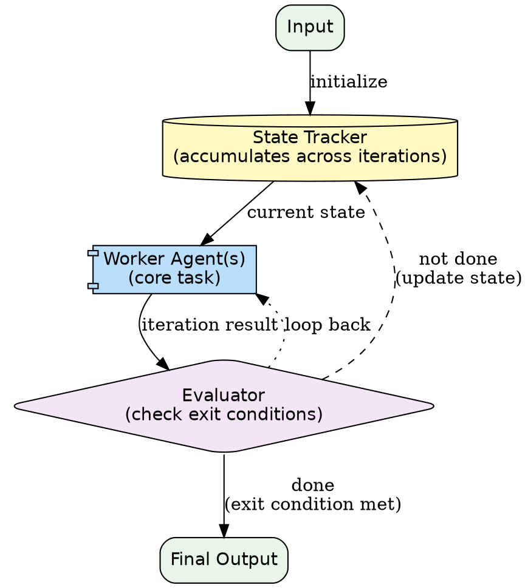

# Loop Multi-Agent Pattern

A loop workflow agent repeatedly executes a sequence of specialized agents until specific termination conditions are met. The pattern supports iterative refinement, self-correction, and convergence toward a quality threshold.

**When to use:** Tasks requiring iterative refinement. Self-correction cycles. Convergence toward a quality threshold. Retry-until-success patterns. Generate-test-fix loops.

---

## Architecture Diagram



**Rendered flow:**

```
Input --> Initialize State
              |
              v
    +---> [ Worker Agent(s) ]
    |           |
    |           v
    |     [ Evaluator ]
    |        /       \
    |      no         yes
    |    (loop)     (exit)
    |      |           |
    +------+           v
                  Final Output
```

The loop continues until the evaluator determines an exit condition is met: quality threshold reached, maximum iterations hit, or convergence detected.

---

## Component Table

| # | Component | Purpose | Inputs | Outputs |
|---|-----------|---------|--------|---------|
| 1 | **Worker Agent(s)** | Performs the core task each iteration | Current state + iteration context | Iteration result |
| 2 | **Evaluator** | Checks whether exit conditions are met | Iteration result + accumulated state | Continue/exit decision + reason |
| 3 | **State Tracker** | Accumulates results and context across iterations | Previous state + latest result | Updated state |
| 4 | **Exit Conditions** | Rules that determine when to stop | Configuration | Boolean check functions |
| 5 | **Loop Orchestrator** | Manages the iteration cycle | Initial input + exit conditions | Final output after loop terminates |

---

## Builder Template

Follow these steps to build a loop multi-agent system.

### Step 1: Define the Worker Agent's Task

What does the worker do on each iteration?

```markdown
**Worker task:** [What the worker produces/transforms each iteration]
**Worker input:** [State from previous iteration or initial input]
**Worker output:** [Result of this iteration's work]
```

Example:
```markdown
**Worker task:** Generate a Python function that passes all test cases
**Worker input:** Function requirements + test cases + previous attempt (if any) + error messages
**Worker output:** Updated function code
```

### Step 2: Define Exit Conditions

Every loop MUST have at least two exit conditions:

```markdown
| Condition | Type | Threshold | Priority |
|-----------|------|-----------|----------|
| Max iterations | Safety limit | 5 iterations | Always checked |
| All tests pass | Quality threshold | 100% pass rate | Primary exit |
| No improvement | Convergence | Same score 2 iterations in a row | Early exit |
```

Always include a **max iterations** safety limit to prevent infinite loops.

### Step 3: Define State

What carries forward between iterations?

```markdown
| State Field | Description | Updated How |
|-------------|-------------|-------------|
| current_code | Latest version of the function | Replaced each iteration |
| test_results | Results from running tests | Replaced each iteration |
| error_history | List of errors from all iterations | Appended each iteration |
| iteration_count | Current iteration number | Incremented |
| score_history | Quality scores over time | Appended |
```

### Step 4: Build the Evaluator Logic

The evaluator checks exit conditions after each iteration:

```
Evaluator prompt:

"You are the loop evaluator. Given the iteration result and accumulated state,
determine whether to continue or exit.

Exit conditions (check in order):
1. iteration_count >= MAX_ITERATIONS --> exit with 'max iterations reached'
2. all tests pass --> exit with 'success'
3. score unchanged for 2 iterations --> exit with 'converged, no improvement'

If none met, return: {"continue": true, "reason": "..."}
If met, return: {"continue": false, "exit_reason": "...", "final_result": "..."}"
```

### Step 5: Wire the Loop

Using Claude Code's Agent tool:

```
Loop orchestrator prompt:

"You are a loop orchestrator. Execute this iterative process:

Initial state: {input}
Max iterations: {MAX}

For each iteration:
1. Call Worker Agent with current state
2. Update state with worker's result
3. Call Evaluator Agent to check exit conditions
4. If evaluator says continue: loop back to step 1
5. If evaluator says exit: return final result

State to pass forward each iteration:
- current result
- error history
- iteration count
- score history"
```

---

## Wiring Instructions (Claude Code Agent Tool)

Wire the loop using the orchestrating agent's reasoning loop. Each iteration involves Agent tool calls.

```
Orchestrating prompt structure:

"You are a loop orchestrator running an iterative refinement process.

TASK: [describe the task]

PROCESS:
1. Start with the initial input
2. Each iteration:
   a. Launch Worker Agent (Agent tool call) with current state
   b. Capture the worker's output
   c. Evaluate: check exit conditions
   d. If not done: update state, increment iteration, go to 2a
   e. If done: return the final result

EXIT CONDITIONS:
- Maximum iterations: [N]
- Success: [quality threshold]
- Convergence: [no improvement for M iterations]

STATE BETWEEN ITERATIONS:
- [field 1]: [description]
- [field 2]: [description]

IMPORTANT: Always enforce the max iteration limit. Never exceed it."
```

Key rules:
- Each iteration's worker `Agent` call is **separate** (sequential, not parallel)
- The evaluator can be the orchestrating agent itself (inline check) or a separate `Agent` call
- State must be explicitly passed in each iteration's prompt
- The **max iterations safety limit is non-negotiable** -- always enforce it

---

## Validation Criteria

| Criterion | How to Verify |
|-----------|---------------|
| Iteration execution | Loop runs at least 2 iterations on a task that needs refinement |
| State persistence | Information from iteration N is available in iteration N+1 |
| Exit on success | Loop terminates when quality threshold is met |
| Exit on max iterations | Loop terminates at the safety limit even without success |
| Convergence detection | Loop detects when no progress is being made |
| Iterative improvement | Each iteration's output is same quality or better than the previous |
| Final output quality | Result after loop completion meets the task requirements |

### Smoke Test

Run a generate-test-fix loop:

1. **Worker:** Generate a Python function to solve a specific problem
2. **Evaluator:** Run test cases against the function
3. **Loop:** If tests fail, pass error messages back to the worker for a fix attempt

**Input:** "Write a function that returns the nth Fibonacci number" + 5 test cases (including edge cases like n=0, n=1).

**Deliberate difficulty:** Include an edge case the naive implementation gets wrong (e.g., n=0 should return 0, not 1).

**Pass criteria:**
- Iteration 1 produces an initial implementation (may fail edge cases)
- Iteration 2+ fixes failures based on error feedback
- Loop exits when all tests pass OR at max iterations
- Max iteration limit is enforced (loop does not run forever)
