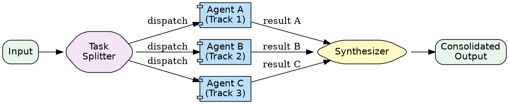

# Parallel Multi-Agent Pattern

Multiple specialized agents perform tasks simultaneously. A parallel workflow agent dispatches all tasks at once and gathers results. Outputs are synthesized into a consolidated response. Reduces latency by running independent work concurrently.

**When to use:** Independent sub-tasks that can run concurrently. Gathering diverse perspectives on the same input. Reducing latency by parallelizing. Any fan-out/fan-in workload.

---

## Architecture Diagram



**Rendered flow:**

```
              +-> [ Agent A (Track 1) ] -+
              |                          |
Input --> Splitter -> [ Agent B (Track 2) ] --> Synthesizer --> Output
              |                          |
              +-> [ Agent C (Track 3) ] -+
```

All agents in the middle tier execute **concurrently**.

---

## Component Table

| # | Component | Purpose | Inputs | Outputs |
|---|-----------|---------|--------|---------|
| 1 | **Task Splitter** | Decomposes input into parallel sub-tasks | Original input | Sub-task assignments (one per agent) |
| 2 | **Track Agents** | Specialized agents, each handling one perspective or sub-task | Sub-task input (same or sliced) | Track-specific result |
| 3 | **Synthesizer** | Merges, votes on, or aggregates results from all tracks | Array of track results | Consolidated output |
| 4 | **Fan-out/Fan-in Orchestrator** | Dispatches agents in parallel and collects results | Split tasks | Gathered results for synthesis |

---

## Builder Template

Follow these steps to build a parallel multi-agent system.

### Step 1: Define Parallel Tracks

```markdown
| Track | Agent Name | Perspective / Task | Input | Output |
|-------|------------|--------------------|-------|--------|
| 1 | Security Analyst | Analyze for security vulnerabilities | Code snippet | Security findings JSON |
| 2 | Performance Reviewer | Analyze for performance issues | Code snippet | Performance findings JSON |
| 3 | Readability Reviewer | Analyze for readability/maintainability | Code snippet | Readability findings JSON |
```

### Step 2: Define Input Distribution

Choose one:

```markdown
- [ ] **Broadcast:** Same input sent to all agents (each analyzes from different angle)
- [ ] **Split:** Input divided into parts, each agent gets a different slice
- [ ] **Hybrid:** Some shared context + unique slice per agent
```

### Step 3: Build Each Track Agent's Prompt

Each track agent gets a focused prompt:

```
You are the [TRACK_NAME] specialist.

Analyze the following input from the perspective of [PERSPECTIVE]:

[INPUT]

Return your findings as:
{
  "track": "[TRACK_NAME]",
  "findings": [
    {"issue": "...", "severity": "high|medium|low", "details": "..."}
  ],
  "summary": "one-sentence summary"
}
```

### Step 4: Define the Synthesis Strategy

Choose one:

```markdown
- [ ] **Merge:** Combine all findings into a unified list
- [ ] **Vote:** Each agent votes, majority wins (for classification tasks)
- [ ] **Aggregate:** Compute statistics across agent results
- [ ] **Rank:** Order results by severity/importance across all tracks
- [ ] **Narrative:** Generate a prose report that weaves together all perspectives
```

### Step 5: Wire Parallel Execution

Using Claude Code's Agent tool, launch all agents in a **single message**:

```
In ONE message, make these Agent tool calls simultaneously:

Agent call 1: Security analysis prompt + input
Agent call 2: Performance analysis prompt + input
Agent call 3: Readability analysis prompt + input

All three run in parallel because they are in the same message.

After all complete, synthesize:
- Merge all findings arrays
- Deduplicate overlapping issues
- Sort by severity
- Generate unified report
```

---

## Wiring Instructions (Claude Code Agent Tool)

The key to parallelism in Claude Code: **multiple Agent tool calls in a SINGLE message run concurrently.**

```
Orchestrating prompt structure:

"You are a parallel analysis coordinator.

Given the input below, dispatch these analyses simultaneously
by making ALL of these Agent tool calls in your NEXT message:

1. Security Agent: [security prompt + input]
2. Performance Agent: [performance prompt + input]
3. Readability Agent: [readability prompt + input]

IMPORTANT: Make all 3 Agent calls in ONE message so they run in parallel.

After all agents return, synthesize by:
- Collecting all findings
- Deduplicating
- Sorting by severity (high > medium > low)
- Writing a unified report with sections per track"
```

Key rules:
- All `Agent` calls must be in the **same message** for parallel execution
- Each agent uses `subagent_type: "general-purpose"`
- The orchestrating agent waits for all results before synthesizing
- If one agent fails, the synthesizer works with available results

---

## Validation Criteria

| Criterion | How to Verify |
|-----------|---------------|
| Concurrent execution | All agents dispatched in a single message (not sequentially) |
| Independence | Each agent's output does not depend on another agent's output |
| Complete coverage | All tracks produce results |
| Synthesis quality | Consolidated output accurately represents all track findings |
| Latency | Total time is roughly max(individual agent times), not sum |
| Partial failure handling | System produces useful output even if one track fails |

### Smoke Test

Analyze a code snippet from 3 perspectives in parallel:

**Input:** A function with a SQL query, a nested loop, and inconsistent naming.

**Expected parallel tracks:**
1. **Security:** Flags SQL injection risk
2. **Performance:** Flags nested loop complexity
3. **Readability:** Flags inconsistent naming

**Pass criteria:** All 3 agents run concurrently (dispatched in one message). Synthesized report contains findings from all 3 perspectives, sorted by severity.
