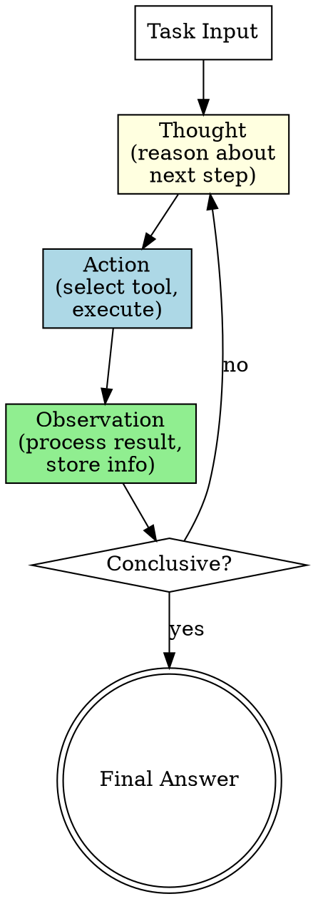

# ReAct (Reason and Act) Pattern

An iterative loop of Thought-Action-Observation cycles. The model reasons about the task (Thought), selects a tool and executes it (Action), receives the result (Observation), and repeats until it can formulate a final answer. Combines chain-of-thought reasoning with tool use in a structured loop.

---

## Architecture



**Flow:** Task arrives. Agent thinks about what it needs to learn or do next (Thought). Agent selects and executes a tool (Action). Agent processes the result (Observation). If the answer is found, agent produces final output. Otherwise, loops back to Thought with accumulated context.

---

## When to Use

- Complex, dynamic tasks requiring continuous planning
- Research questions needing multiple tool calls
- Codebase investigation where each finding informs the next search
- Data gathering from multiple sources where results guide next queries
- Any task where the next step depends on previous observations
- Debugging workflows that follow a trail of evidence
- Multi-step API interactions

---

## Component Table

| # | Component          | Role                                                      | Implementation Notes                              |
|---|-------------------|-----------------------------------------------------------|---------------------------------------------------|
| 1 | Reasoning Engine   | Chain-of-thought that decides the next action              | The AI model's natural reasoning capability       |
| 2 | Tool Set           | Available actions the agent can take                       | Read, Grep, Glob, Bash, WebSearch, API calls, etc |
| 3 | Observation Buffer | Accumulated findings from previous cycles                  | Running context that grows with each iteration    |
| 4 | Termination Logic  | Determines when to stop and produce final answer           | Found answer, max steps, dead end, confidence     |
| 5 | Scratchpad         | Running log of all Thought-Action-Observation triples      | Structured record enabling backtracking           |

---

## Builder Template

Follow these steps to construct a ReAct workflow:

### Step 1: Define the Task and Available Tools

Specify:
- **Task description** -- what question to answer or goal to achieve
- **Tool inventory** -- which tools the agent can use, with descriptions
- **Tool constraints** -- any tools that should only be used in certain conditions

Example tool set for codebase investigation:
```
Tools available:
- Grep: search for patterns across files
- Read: read specific file contents
- Glob: find files by name pattern
- Bash: run commands for build/test information
```

### Step 2: Structure the Prompt to Enforce TAO Format

The prompt must instruct the agent to follow this cycle explicitly:

```
For each step, use this exact format:

**Thought:** [What I know so far, what I still need to find, what my plan is for this step]

**Action:** [Tool name and parameters]

**Observation:** [Summary of what the tool returned and what it means for my investigation]

Repeat until you can provide:

**Final Answer:** [Complete answer to the original question with supporting evidence]
```

### Step 3: Define Termination Conditions

The agent should stop when any of these apply:
- **Answer found:** sufficient evidence to answer the question confidently
- **Max steps reached:** hard limit (typically 10-15 steps) to prevent runaway loops
- **Dead end:** no more productive actions available
- **Confidence threshold:** agent's stated confidence exceeds threshold

### Step 4: Build the Scratchpad Format

Accumulated context structure:
```
## Scratchpad

### Step 1
- Thought: [reasoning]
- Action: [tool call]
- Observation: [result summary]
- Key finding: [extracted insight]

### Step 2
- Thought: [reasoning, referencing Step 1]
- Action: [tool call]
- Observation: [result summary]
- Key finding: [extracted insight]

## Running Summary
[Evolving summary of what has been learned so far]
```

### Step 5: Wire the Loop

Two implementation approaches:

**Implicit (natural):** Single Agent call with TAO-structured prompt. The model naturally loops through Thought-Action-Observation using available tools. This is how Claude Code operates by default.

**Explicit (controlled):** Programmatic loop where each iteration is a separate Agent call:
```
scratchpad = ""
for step in range(max_steps):
    result = Agent(
        prompt = task + scratchpad + "What is your next Thought and Action?"
    )
    scratchpad += format_step(result)
    if result.contains_final_answer:
        break
```

---

## Wiring Instructions (Claude Code Agent Tool)

**Implicit wiring (recommended for most cases):**
Use a single Agent tool call with a well-structured prompt. The prompt should:
1. State the task clearly
2. List available tools
3. Require TAO format for each step
4. Specify termination conditions
5. Request a final answer with evidence

Claude Code's Agent tool naturally supports the ReAct loop -- the agent will reason, call tools, observe results, and iterate until done.

**Explicit wiring (for fine-grained control):**
Use multiple sequential Agent tool calls, one per TAO cycle. Each call receives:
- The original task
- The accumulated scratchpad from previous cycles
- Instructions for one Thought-Action-Observation cycle

After each call, check:
- Did the agent produce a final answer? If yes, stop.
- Has the max step count been reached? If yes, force final answer.
- Otherwise, append to scratchpad and continue.

**Key wiring considerations:**
- Context window management: scratchpad grows each iteration; summarize periodically
- Tool failures: the Thought step should reason about failed actions and try alternatives
- Backtracking: if a line of investigation is unproductive, the agent should recognize this and try a different approach
- The implicit approach is simpler and usually sufficient; use explicit only when you need programmatic control over each step

---

## Validation Criteria

| Check                        | What to Verify                                                          |
|------------------------------|-------------------------------------------------------------------------|
| Purposeful reasoning         | Each Thought explains why the next action is chosen                     |
| Action relevance             | Actions are purposeful, not random exploration                          |
| Observation utilization      | Each new Thought references findings from previous Observations         |
| Progressive refinement       | Investigation narrows over time, not circling                           |
| Termination correctness      | Agent stops when answer is found, not prematurely or too late           |
| Max step enforcement         | Hard limit prevents runaway loops                                       |
| Dead end recovery            | Agent recognizes unproductive paths and changes strategy                |
| Final answer evidence        | Final answer cites specific observations as supporting evidence         |
| Tool selection appropriateness | Agent chooses the right tool for each step (not using Bash when Grep suffices) |
