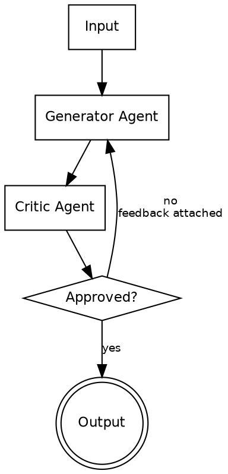

# Review & Critique Pattern

A generator agent creates initial output. A critic agent evaluates against predefined criteria. The critic approves, rejects, or returns content with revision feedback. The generator then incorporates feedback and resubmits. This is a specialized loop pattern where the loop condition is driven by a second agent's judgment.

---

## Architecture



**Flow:** Input feeds the generator. The generator produces output. The critic evaluates against criteria. If approved, output is returned. If rejected, the critic's structured feedback is appended to the generator's next prompt, and the loop repeats.

---

## When to Use

- Outputs requiring high accuracy before user presentation
- Code generation needing security or correctness review
- Content needing compliance, legal, or brand checks
- Any output where quality gates matter and a single pass is insufficient
- When you need an explicit approve/reject decision, not just progressive improvement

**Do not use when:** Simple tasks where a single generation is sufficient. Overhead of two agents is not justified for low-stakes output.

---

## Component Table

| # | Component | Role | Implementation |
|---|-----------|------|----------------|
| 1 | Generator Agent | Creates or revises the output based on task + any prior feedback | Agent tool call with generation prompt |
| 2 | Critic Agent | Evaluates output against criteria, produces structured verdict | Agent tool call with review prompt + criteria checklist |
| 3 | Criteria Definition | What "good" looks like -- the standard the critic evaluates against | Checklist embedded in the critic's prompt |
| 4 | Feedback Format | Structured format for critic-to-generator communication | JSON or markdown with verdict, issues list, and suggestions |
| 5 | Max Revision Limit | Safety cap on iterations to prevent infinite loops | Counter checked before each generator call (typically 3) |

---

## Builder Template

Follow these steps to construct a review-critique system:

### Step 1: Define the generation task and output format

Specify exactly what the generator produces. Be precise about format, length, and structure so the critic has clear expectations.

```
Generation task: [e.g., "Write a Python function that..."]
Output format: [e.g., "Python code block with docstring and type hints"]
```

### Step 2: Define review criteria

Build the checklist the critic evaluates against. Each criterion should be binary (pass/fail) or scored.

```
Criteria checklist:
- [ ] Correctness: Does the output solve the stated problem?
- [ ] Completeness: Are all requirements addressed?
- [ ] Security: No injection vulnerabilities, no hardcoded secrets?
- [ ] Style: Follows project conventions?
- [ ] Edge cases: Handles boundary conditions?
```

### Step 3: Build the generator prompt

The generator prompt must accept and incorporate feedback from prior iterations.

```
You are a [domain] specialist. Generate [output type] for the following task.

Task: {task_description}

{if feedback exists}
PREVIOUS ATTEMPT FEEDBACK:
Your prior output was reviewed and rejected. Address these issues:
{feedback}
{end if}

Produce your output now.
```

### Step 4: Build the critic prompt

The critic must produce a structured approve/reject verdict with actionable feedback.

```
You are a [domain] reviewer. Evaluate the following output against the criteria below.

OUTPUT TO REVIEW:
{generator_output}

CRITERIA:
{criteria_checklist}

Respond with:
- verdict: APPROVE or REJECT
- issues: [list of specific problems found, empty if approved]
- suggestions: [specific revision instructions for each issue]
```

### Step 5: Wire the loop

```
iteration = 0
max_iterations = 3
feedback = ""

while iteration < max_iterations:
    generator_output = Agent(generator_prompt + feedback)
    critic_response = Agent(critic_prompt + generator_output)

    if critic_response.verdict == "APPROVE":
        return generator_output

    feedback = critic_response.issues + critic_response.suggestions
    iteration += 1

# Fallback: return best effort with warning
return generator_output + "\n[WARNING: Did not pass review after {max_iterations} iterations]"
```

### Step 6: Define fallback behavior

Decide what happens if max iterations are reached without approval:
- Return the last output with a warning annotation
- Return the last output plus the critic's remaining concerns
- Escalate to a human reviewer
- Return nothing and report failure

---

## Wiring Instructions (Claude Code Agent Tool)

In Claude Code, wire this pattern using sequential Agent tool calls in a loop:

1. **First Agent call (Generator):** Pass the task description. On subsequent iterations, append the critic's feedback to the prompt.

2. **Second Agent call (Critic):** Pass the generator's output plus the criteria checklist. Instruct the critic to return a structured response with verdict and feedback.

3. **Loop control:** Parse the critic's response. If verdict is APPROVE, return the generator's output. If REJECT, extract feedback and loop back to step 1.

4. **Iteration tracking:** Maintain a counter outside the Agent calls. Cap at 3 iterations. On the final iteration, inform the generator this is the last chance.

5. **Context accumulation:** Each iteration, the generator receives the original task plus all prior feedback. Do not discard earlier feedback -- it prevents regression.

---

## Validation Criteria

A correctly wired review-critique pattern demonstrates:

| Check | Expected Behavior |
|-------|-------------------|
| Generator produces output | First iteration generates complete output matching the requested format |
| Critic evaluates against criteria | Critic references specific criteria from the checklist in its review |
| Feedback is actionable | Critic's rejection includes specific issues and concrete revision suggestions |
| Generator incorporates feedback | Second iteration output addresses the specific issues raised by the critic |
| No regression | Fixing one issue does not introduce new issues that were passing before |
| Loop terminates on approval | When critic approves, no further iterations occur |
| Loop terminates on max iterations | After 3 iterations (or configured max), loop exits with fallback behavior |
| Fallback is handled | If max iterations reached, the system produces a result (not a hang or crash) |
