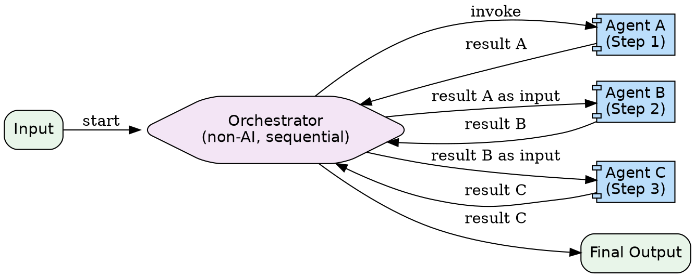

# Sequential Multi-Agent Pattern

Multiple specialized agents execute in a predefined linear order. A non-AI workflow orchestrator manages the pipeline. Output from one agent becomes input for the next. No AI model decides the sequence -- it is hardcoded.

**When to use:** Fixed-order pipelines. ETL processes. Assembly-line workflows where each step transforms the output of the previous step.

---

## Architecture Diagram



**Rendered flow:**

```
Input --> [ Agent A (Step 1) ] --> [ Agent B (Step 2) ] --> [ Agent C (Step 3) ] --> Final Output
                        ^                    ^                    ^
                        |____________________|____________________|
                                 Non-AI Orchestrator
```

---

## Component Table

| # | Component | Purpose | Inputs | Outputs |
|---|-----------|---------|--------|---------|
| 1 | **Pipeline Definition** | Ordered list of stages with names and purposes | Requirements | Stage list with sequence |
| 2 | **Stage Agent (per step)** | Specialized agent for one transformation | Stage-specific input (output of prior stage) | Transformed output |
| 3 | **Handoff Contracts** | Define output format of step N = input format of step N+1 | Stage specs | Schema or format spec per boundary |
| 4 | **Orchestrator** | Non-AI controller that runs steps in order and passes data | Pipeline definition + initial input | Final pipeline output |
| 5 | **Error Handler** | What happens when a stage fails | Error from failed stage | Retry, skip, or abort decision |

---

## Builder Template

Follow these steps to build a sequential multi-agent pipeline.

### Step 1: Define Pipeline Stages

```markdown
| Stage | Name | Purpose | Input Format | Output Format |
|-------|------|---------|--------------|---------------|
| 1 | Extractor | Extract key facts from raw text | Raw text (string) | JSON array of facts |
| 2 | Formatter | Reformat facts as bullet points | JSON array of facts | Markdown bullet list |
| 3 | Summarizer | Generate a concise summary | Markdown bullet list | Summary paragraph |
```

### Step 2: Define Handoff Contracts

For each boundary between stages, specify the exact format:

```markdown
**Stage 1 --> Stage 2:**
Output: JSON array of objects `[{"fact": "...", "source": "..."}, ...]`
Input:  Same JSON array

**Stage 2 --> Stage 3:**
Output: Markdown string with `- ` prefixed lines
Input:  Same markdown string
```

### Step 3: Build Each Stage Agent's Prompt

Each stage agent gets a focused system prompt:

```
You are the [STAGE_NAME] agent.

Your task: [SPECIFIC_TASK]

Input format: [INPUT_SPEC]
Output format: [OUTPUT_SPEC]

Rules:
- Only output in the specified format
- Do not add commentary outside the output
- If input is malformed, return an error JSON: {"error": "[description]"}
```

### Step 4: Wire the Orchestrator

Using Claude Code's Agent tool, wire sequential calls:

```
1. Call Agent tool with Stage 1 prompt + user input
   -> Capture result_1

2. Call Agent tool with Stage 2 prompt + result_1 as input
   -> Capture result_2

3. Call Agent tool with Stage 3 prompt + result_2 as input
   -> Capture result_3 (final output)
```

Each agent call uses `subagent_type: "general-purpose"`.

### Step 5: Add Error Handling

Define what happens when a stage fails:

```markdown
- **Retry:** Re-invoke the failed stage (max 1 retry)
- **Skip:** Move to next stage with partial data (only if stage is optional)
- **Abort:** Stop pipeline and return error with the stage that failed
```

---

## Wiring Instructions (Claude Code Agent Tool)

Wire the pipeline using sequential `Agent` tool calls. Each call is a separate `Agent` tool invocation. The orchestrating prompt manages the flow.

```
Orchestrating prompt structure:

"You are a pipeline orchestrator. Run these stages in order:

Stage 1 - Extractor: [prompt]. Input: {user_input}
Stage 2 - Formatter: [prompt]. Input: {output of stage 1}
Stage 3 - Summarizer: [prompt]. Input: {output of stage 2}

For each stage:
1. Launch an Agent tool call with the stage prompt and input
2. Wait for the result
3. Pass the result as input to the next stage
4. If a stage returns an error, retry once, then abort if it fails again

Return the final stage's output."
```

Key rules:
- Each `Agent` call is **separate** (not in the same message) so they run **sequentially**
- Pass the full output of stage N as input context to stage N+1
- The orchestrating agent does NOT modify inter-stage data -- it only passes it forward

---

## Validation Criteria

| Criterion | How to Verify |
|-----------|---------------|
| Sequential execution | Stages run in defined order, not in parallel |
| Handoff contract compliance | Output of stage N matches input spec of stage N+1 |
| Data integrity | No data loss between stages |
| Error propagation | A failing stage triggers the defined error handling |
| Final output correctness | End-to-end result is correct for a known input |

### Smoke Test

Run a 3-stage text pipeline:

1. **Extract:** Given a paragraph, extract key facts as JSON
2. **Format:** Convert JSON facts to markdown bullet points
3. **Summarize:** Generate a one-sentence summary from the bullets

**Input:** A paragraph about a company's quarterly results.

**Pass criteria:** Each stage produces output in the correct format. The final summary accurately reflects the original paragraph's key points. Stages execute in order.
