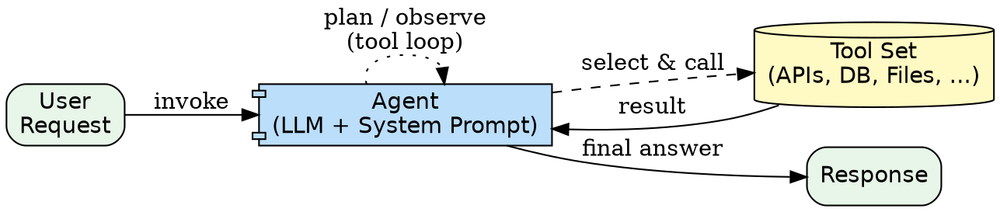

# Single Agent Pattern

The simplest agentic pattern. One AI model uses a set of tools and a comprehensive system prompt to autonomously handle requests. The model interprets requests, plans execution steps, and decides which tools to apply.

**When to use:** Starting point for any agent. Multi-step tasks with tool use. Customer support, research, data queries.

---

## Architecture Diagram



**Rendered flow:**

```
User Request --> [ Agent (LLM + System Prompt) ] <--> [ Tool Set ]
                           |
                           v
                       Response
```

The agent enters an internal loop: **plan --> select tool --> execute --> observe --> plan again** until it has enough information to respond.

---

## Component Table

| # | Component | Purpose | Inputs | Outputs |
|---|-----------|---------|--------|---------|
| 1 | **System Prompt** | Defines persona, task scope, tool usage rules, constraints, guardrails | Agent purpose description | Formatted system prompt string |
| 2 | **Tool Definitions** | Declares what the agent can do (function names, descriptions, parameter schemas) | Capability requirements | Tool schema array |
| 3 | **Entry Point** | How the agent is invoked (CLI, API, chat interface) | User request | Formatted prompt passed to LLM |
| 4 | **Guardrails** | What the agent must refuse or escalate | Risk assessment | Refusal rules in system prompt |

---

## Builder Template

Follow these steps to build a single agent from scratch.

### Step 1: Define Purpose and Persona

Write a one-sentence purpose statement and a persona description.

```markdown
**Purpose:** [What does this agent do?]
**Persona:** [Who is this agent? What tone, expertise, and constraints?]
```

### Step 2: List Available Tools

Enumerate every tool the agent can use. For each tool, specify:

```markdown
| Tool Name | Description | Parameters | Returns |
|-----------|-------------|------------|---------|
| search_docs | Search internal documentation | query: string | Array of matching doc snippets |
| run_query | Execute a SQL query | sql: string, db: string | Query results as JSON |
| ... | ... | ... | ... |
```

### Step 3: Write the System Prompt

Include these sections in the system prompt:

1. **Role statement** -- who the agent is
2. **Capabilities** -- what the agent can do (reference tools)
3. **Constraints** -- what the agent must not do
4. **Tool usage rules** -- when to use which tool, in what order
5. **Output format** -- how to structure responses
6. **Guardrails** -- refusal conditions, escalation triggers

```
You are [PERSONA]. Your job is to [PURPOSE].

You have access to these tools:
- [TOOL_1]: [description]. Use when [condition].
- [TOOL_2]: [description]. Use when [condition].

Rules:
- Always [RULE_1].
- Never [RULE_2].
- If [CONDITION], escalate to a human.

Respond in [FORMAT].
```

### Step 4: Define Input/Output Format

```markdown
**Input:** [Natural language request | structured JSON | ...]
**Output:** [Natural language response | JSON | markdown report | ...]
```

### Step 5: Add Guardrails

List what the agent should refuse:

```markdown
- Refuse requests that [CONDITION_1]
- Refuse requests that [CONDITION_2]
- If uncertain, say so rather than guessing
```

---

## Wiring Instructions

The single agent pattern uses Claude Code's built-in tool loop. **No Agent subagent is needed.** The model itself is the agent.

1. Place the system prompt and tool definitions in the agent's configuration
2. Send the user request as the user message
3. The LLM automatically enters its tool loop: plan, select tool, execute, observe, repeat
4. The LLM returns a final response when it determines it has enough information

There is no orchestration code to write. The model handles planning, tool selection, and execution internally.

---

## Validation Criteria

| Criterion | How to Verify |
|-----------|---------------|
| Tool selection | Agent selects the correct tool for a given request |
| Multi-step reasoning | Agent chains 2+ tool calls to answer a complex question |
| Guardrail enforcement | Agent refuses out-of-scope or dangerous requests |
| Coherent output | Final response is well-structured and answers the question |
| Error handling | Agent handles tool failures gracefully (retries or explains) |

### Smoke Test

Give the agent a question that **requires using 2+ tools** to answer. For example:

> "What is the average response time for our API, and which endpoint is slowest?"

This requires the agent to (1) query metrics data, (2) analyze the results, and (3) identify the slowest endpoint -- exercising multi-step tool use and reasoning.

**Pass criteria:** Agent calls the right tools in a logical order, synthesizes results, and returns a clear answer.
