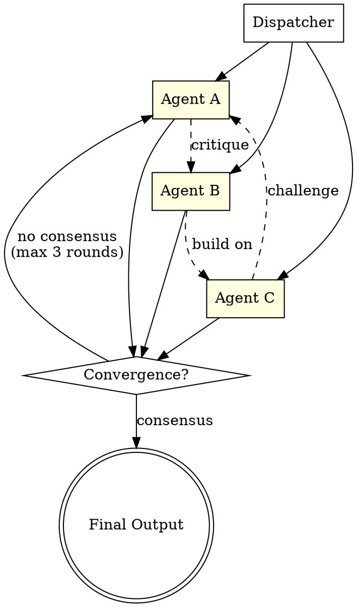

# Swarm Pattern

Multiple specialized agents collaborate with all-to-all communication. A dispatcher routes the initial request. Agents share findings, critique proposals, build on each other's work, and hand off based on capability. Iterative refinement through collaborative debate. No central supervisor -- explicit exit conditions required.

---

## Architecture



**Flow:** Dispatcher fans out to all swarm agents in parallel. Each agent produces independent analysis (Round 1), then receives all other agents' outputs for cross-critique (Round 2+). Convergence check after each round. Exit on consensus or max rounds.

---

## When to Use

- Complex, ambiguous problems benefiting from debate
- Design decisions with competing tradeoffs
- Product design requiring market, engineering, and financial perspectives
- Architecture reviews where security, performance, and maintainability trade off
- Any problem where no single perspective is sufficient
- Strategic planning with multiple stakeholder concerns

---

## Component Table

| # | Component              | Role                                                    | Implementation Notes                        |
|---|------------------------|---------------------------------------------------------|---------------------------------------------|
| 1 | Dispatcher             | Routes initial request to all swarm agents              | Formats task for each agent's perspective   |
| 2 | Swarm Agents (3+)      | Specialized perspectives that analyze independently     | Each has a distinct expertise and viewpoint  |
| 3 | Communication Protocol | Defines how agents share findings and critique          | Structured format: findings, critique, proposal |
| 4 | Convergence Mechanism  | Detects when agents have reached consensus              | Similarity check, vote, or synthesis judge  |
| 5 | Exit Conditions        | Prevents infinite loops                                 | Max rounds (2-3), consensus threshold, timeout |
| 6 | Synthesis              | Merges all perspectives into final coherent output      | Can be a dedicated synthesis agent or merge logic |

---

## Builder Template

Follow these steps to construct a swarm workflow:

### Step 1: Define the Swarm Members

For each agent, specify:
- **Name** -- a clear role label (e.g., "Security Analyst", "Performance Engineer")
- **Perspective** -- what lens they apply to the problem
- **Expertise** -- what knowledge domain they draw from
- **Bias** -- what they tend to prioritize (makes debate productive)

Example swarm for architecture review:
```
Agent A: Security Analyst -- prioritizes threat mitigation, compliance
Agent B: Performance Engineer -- prioritizes speed, scalability, resource efficiency
Agent C: Maintainability Advocate -- prioritizes code clarity, testing, long-term cost
```

### Step 2: Define the Debate Protocol

Each agent's output in Round 2+ must contain:
```
## My Updated Analysis
[Revised analysis incorporating feedback]

## Critique of Other Agents
- Agent X: [agreement/disagreement with reasoning]
- Agent Y: [agreement/disagreement with reasoning]

## My Proposal
[Concrete recommendation with justification]

## Consensus Assessment
[Do I believe we are converging? What remains disputed?]
```

### Step 3: Define Convergence Criteria

Choose one or combine:
- **Vote convergence:** All agents recommend the same option
- **Overlap threshold:** 80%+ agreement on key points
- **Synthesis judge:** A separate agent reads all outputs and determines if consensus exists
- **Forced synthesis:** After max rounds, synthesize regardless

### Step 4: Build Each Agent's Prompt

Round 1 prompt template:
```
You are [Agent Name], an expert in [expertise].
Analyze the following from your perspective: [task]
Produce:
1. Key findings from your perspective
2. Risks you identify
3. Your recommended approach
4. Confidence level (high/medium/low)
```

Round 2+ prompt template:
```
You are [Agent Name]. Here are the other agents' analyses:
[Agent X output]
[Agent Y output]

Now:
1. Critique their analyses from your perspective
2. Update your own analysis based on their input
3. State your revised recommendation
4. Assess whether consensus is forming
```

### Step 5: Wire the Rounds

```
Round 1: Parallel Agent calls (all agents independently)
         |
         v
     Gather all outputs
         |
         v
Round 2: Parallel Agent calls (each receives all others' outputs)
         |
         v
     Check convergence
         |
    [consensus?] --yes--> Synthesize final output
         |
        no
         |
         v
Round 3: Repeat (or force synthesis at max rounds)
```

### Step 6: Define Synthesis Strategy

After convergence or max rounds:
- Identify points of agreement across all agents
- Identify remaining disagreements with each agent's reasoning
- Produce a final recommendation that accounts for all perspectives
- Flag unresolved tensions for human decision

### Step 7: Set Max Rounds

Typical: 2-3 rounds. More than 3 rarely adds value and increases cost.

---

## Wiring Instructions (Claude Code Agent Tool)

**Round 1 -- Independent Analysis:**
Launch parallel Agent tool calls, one per swarm member. Each agent receives the task with their role prompt. No cross-references at this stage.

**Gather Phase:**
Collect all Round 1 outputs. Format them into a combined context block.

**Round 2 -- Cross-Critique:**
Launch parallel Agent tool calls again. Each agent now receives the combined outputs from Round 1 plus instructions to critique and update.

**Convergence Check:**
After Round 2, use an Agent call (or direct analysis) to assess convergence:
- Parse each agent's consensus assessment
- Check if proposals align
- If converged or max rounds reached, proceed to synthesis

**Synthesis:**
Final Agent call that receives all round outputs and produces merged recommendation.

**Key wiring considerations:**
- Each round doubles context size -- keep agent outputs concise
- Use structured output formats so agents can parse each other's work
- The dispatcher can be a simple prompt or an Agent call that classifies the task first
- For large swarms (5+ agents), consider sub-groups that converge before cross-group debate

---

## Validation Criteria

| Check                          | What to Verify                                                        |
|--------------------------------|-----------------------------------------------------------------------|
| Independent perspectives       | Round 1 outputs differ meaningfully -- agents are not echoing each other |
| Cross-critique quality         | Round 2 references specific points from other agents' work            |
| Perspective preservation       | Each agent maintains their unique viewpoint, not just agreeing        |
| Synthesized output             | Final output reflects multiple perspectives, not just one agent's view |
| Exit condition enforcement     | Workflow terminates at max rounds even without consensus              |
| Convergence detection          | Consensus is correctly identified when agents agree                   |
| Diminishing returns            | Round 3 adds meaningful value over Round 2 (if used)                  |
| Structured communication       | Agents follow the debate protocol format consistently                 |
